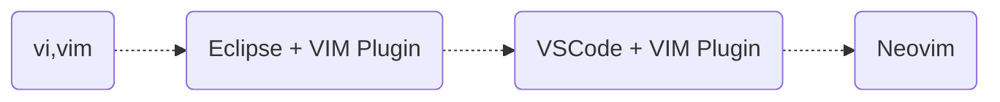

# Back To VIM

위 그림을 보니, 환경은 바뀌어도 VIM은 놓지 않고 있었네요. \
다시 VIM (Neovim)으로 돌아올 썰을 풀어 볼까 합니다.

저 시기 맘에 드는 에디터(Editplus, Ultraedit?)가 없기도 하고,
대 부분은 개발환경을 터미널 기반에서 개발을 하다 보니. 아주 자연스럽게 VIM을 기본 에디터로 사용을 하였네요.

물론 가끔, 많은 파일을 여는 경우는 Ultraedit(With FTP)를 사용하기도 했지만,
Buffer을 알고 나서는 그것조차 거의 사용을 하지 않았네요.

물론 지금 작성하는 README.md 파일도 Neovim(이하 vi) + Markdown Plugin 으로 실시간으로 결과를 보면서 작성을 하고 있습니다.

최근 회사에 담당 업무가 줄어들어, 머 하고 놀까 하다가, Neovim을 가지고 놀았고, VScode + VIM기반 사용하다가 다시 vi로 돌아왔습니다.

## 왜 다시 ???

다른 에디터를 놔두고 특히 VSCode라면 대세인데 왜 라고 하신다면 ...

* vi로 IDE로 사용가능합니다. (온갖 언어 및 환경을 지원합니다.)
* 일단 가볍습니다. (물론 Plugin들이 많아지면서 좀 느려진것 같지만, 그래도 빠릅니다.)
* 마우스가 싫습니다. ^^ (키보드에서 마우스로 이동하는 그리고 마우스 손목 꺽임등)
* 즉 키보드에서 모든것이 가능합니다. \
  (텐키리스 키보드의 오른쪽도 필요 없습니다. 상단(F1-12)도 필요 없을듯 한데, 거기까진 무리내요)
* **나 만의 커스텀 에디터가 가능합니다.** \
  (단축키, Plugin, 개발환경, 실행환경등 거의 개인 Editor입니다.)

  ...

